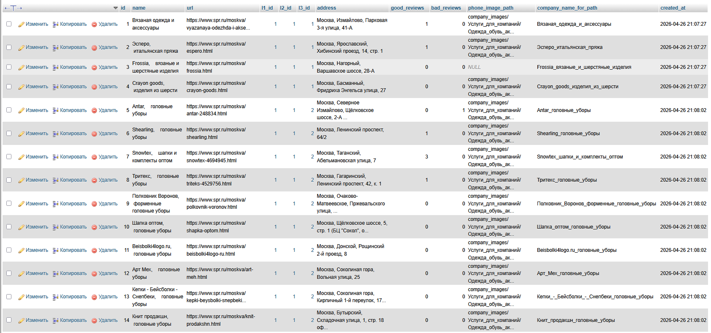
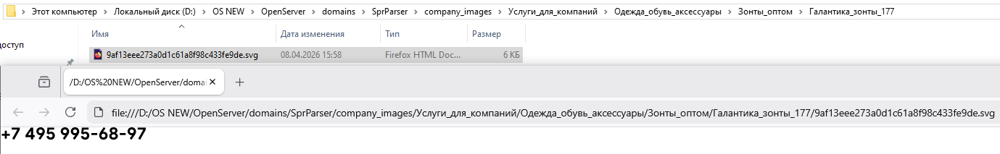

# Spr.ru Parser 🕷️
[Английская версия этой документации доступна тут](README.md)

Скрипт для автоматического сбора данных об организациях с сайта spr.ru. Поддерживает вложенные категории (L1-L3), **AJAX-подгрузку скрытых категорий и динамической пагинации** и сохранение контактов.

## 🚀 Особенности

*   **🏗️ Авто-создание БД:** При первом запуске скрипт сам создаст все необходимые таблицы.
*   **💾 Умное кэширование:** Страницы сохраняются в базу (`page_cache`), чтобы не делать повторных запросов.
*   **📝 Логирование:** Процесс работы записывается в таблицу `parser_logs`. **Важно:** логи очищаются и обновляются при каждом новом запуске.
*   **🛡️ Обход защит:** Использование пауз между запросами (`Crawl-delay`) и поддержка прокси.
*   **🔄 AJAX-обработка:** Автоматически раскрывает и парсит скрытые категории L3 за кнопкой "Ещё", а также обрабатывает динамическую подгрузку компаний через AJAX-пагинацию.
*   **Скрытые категории L3:** Автоматически раскрывает и парсит категории, скрытые за кнопкой "Ещё" (динамическая подгрузка через AJAX).
*   **Бесконечная пагинация:** Обрабатывает AJAX-подгрузку компаний при прокрутке/клике по кнопке "Загрузить ещё".

## 🛠️ Настройка

1. **База данных:** Создайте пустую базу в MySQL (например, `spr_parser`).
2. **Конфигурация:** В файле `index.php` (строки 24-28) укажите параметры подключения к вашему серверу БД:

   ```php
   private $dbName = 'название_вашей_бд'; 
   private $dbHost = 'хост_бд'; 
   private $dbUser = 'имя_пользователя';
   private $dbPass = 'пароль';
   ```
   
## ⚙️ Установка и запуск

Проект является CLI-инструментом. Запуск через терминал гарантирует стабильную работу без ограничений по времени (таймаутов), которые есть в браузере.

1. **Клонируйте репозиторий**:
   ```bash
   git clone https://github.com/KOSTYA0003/spr-content-parser.git
   cd spr-content-parser
   ```
   
2. **Установите зависимости** (библиотека DiDom и др.):
   ```bash
   composer install
   ```

3. **Настройте подключение к БД** в файле `index.php` (секция настройки).

4. **Запустите парсер**:
   ```bash
   php index.php
   ```

## 📂 Что собирает парсер

- Названия, адреса и телефоны компаний.
- Количество отзывов (положительные/отрицательные).
- Иерархию категорий (L1 → L2 → L3).
- Изображения телефонов: Сохраняются в папку company_images с распределением по вложенным папкам категорий вида L1/L2/L3/Название_компании_id/.

## 🔧 Технические детали

- Структура категорий: Парсер рекурсивно обходит все доступные категории L1, L2 и раскрытые L3.
- Селекторы: Адаптированы под текущую структуру DOM сайта.

### 📂 Структурированное хранение данных

Скрипт автоматически распределяет изображения и контактные данные по вложенным папкам, соответствующим категориям сайта.
*   **Извлечение защищенных данных**: Обработка и сохранение контактных телефонов, представленных в формате SVG.

## 🖼️ Интерфейс и структура данных

### 📊 Хранение данных в БД

Демонстрация структуры таблиц и собранных данных. Реализована нормализация и сохранение связей между категориями (L1-L3).


### 📂 Файловая система и обход защиты

Пример автоматического распределения данных по вложенным папкам и успешного извлечения контактных номеров, скрытых за SVG-изображениями.


## License: MIT
